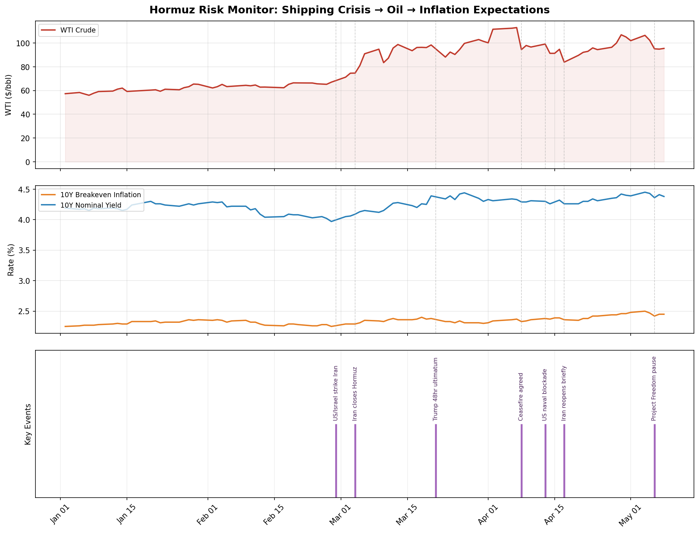

# Hormuz Risk Monitor

*A fixed income macro research tool tracking geopolitical risk 
transmission through oil markets to U.S. inflation expectations.*

---

## Motivation

As a fixed income researcher, the central question I care about is:
**what drives the yield curve?**

The 2026 Strait of Hormuz crisis offered a rare natural experiment.
When Iran closed the strait on March 4, 2026 — cutting off ~20% of 
global oil supply — it created a direct, observable shock to the 
oil → inflation → Fed policy transmission chain.

I built this tool to answer a specific question:

> *Did the Hormuz blockade strengthen the pass-through from daily 
> oil price moves to 10-year inflation expectations?*

If it did, that has real implications for duration positioning: 
a world where oil and breakevens move together more tightly is a 
world where geopolitical risk directly reprices your bond portfolio 
every day.

---

## Key Finding

**Yes — and the data shows it clearly.**

| Period | Oil vs. Breakeven Correlation | N (trading days) |
|--------|-------------------------------|-----------------|
| Pre-blockade (Jan–Apr 12) | r = 0.525 | 68 |
| Post-blockade (Apr 13–now) | r = 0.629 | 20 |

The pass-through from oil price changes to 10Y breakeven inflation 
strengthened meaningfully after the blockade began. In practical 
terms: post-April 13, every $1 move in WTI carries more information 
about where inflation expectations are going than it did before.

This matters for rates traders because breakeven inflation is a 
direct input to nominal yield pricing. A tighter oil-breakeven 
relationship means geopolitical headlines are moving bond markets 
faster and more reliably than before the crisis.

---

## What This Tool Does

Pulls and analyzes daily:
- **WTI crude oil** — Yahoo Finance (`CL=F`)
- **10Y nominal Treasury yield** — FRED (`DGS10`)
- **10Y TIPS real yield** — FRED (`DFII10`)
- **10Y breakeven inflation** — FRED (`T10YIE`)
- **Hormuz/Iran news headlines** — NewsAPI

Stores everything in SQLite and produces a three-panel chart:
1. WTI oil price with key event markers
2. 10Y breakeven vs. nominal yield
3. Crisis event timeline

---

## The Chart



*Dashed lines mark key events. Note how breakeven inflation (orange) 
begins trending upward in earnest after Iran closes Hormuz (Mar 4), 
and continues rising through the US naval blockade (Apr 13).*

---

## Setup

**1. Clone the repository**
```bash
git clone https://github.com/fma8777/hormuz-risk-monitor.git
cd hormuz-risk-monitor
```

**2. Create a conda environment**
```bash
conda create -n macro_project python=3.11
conda activate macro_project
pip install pandas yfinance fredapi requests beautifulsoup4 matplotlib python-dotenv
```

**3. Add your API keys**

Create a `.env` file in the project root:

## Usage

```bash
python fetch_data.py   # Pull market data → SQLite
python scrape.py       # Fetch news headlines → SQLite  
python analyze.py      # Run correlation analysis
python visualize.py    # Generate three-panel chart
```

---

## Challenges & Notes to Self

**1. Virtual environments matter immediately.**
First error on Day 1: ran the script in `(base)` instead of 
`(macro_project)` and got `ModuleNotFoundError`. The fix is 
always the same — check the leftmost word in your terminal prompt 
before running anything. `(base)` = wrong room.

**2. APIs have hidden structure.**
`yfinance` returns a MultiIndex DataFrame (two header rows: 
"Price" and "Ticker"). Pandas `.join()` refused to merge it with 
the single-index FRED data. Fix: `df.columns = df.columns.get_level_values(0)` 
to flatten before joining. Lesson: always `print(df.head())` and 
`print(df.columns)` before assuming a DataFrame is shaped the way 
you think.

**3. Free APIs have real limitations.**
NewsAPI free tier only returns recent articles — no historical 
data. This means the news count panel can't show volume over time 
without a paid subscription. Rather than pretend the limitation 
doesn't exist, I documented it and replaced the bar chart with a 
manually-curated event timeline. In real research, knowing *what 
data you don't have* is as important as knowing what you do.

**4. Market prices are forward-looking — always.**
The biggest conceptual surprise: oil prices started rising in 
January, two months before Iran formally closed Hormuz on March 4. 
The market was pricing in the probability of closure weeks before 
it happened. When the closure was announced, prices *fell* — 
classic "buy the rumor, sell the news." This is not a data anomaly. 
This is how markets work. A fixed income researcher who forgets 
this will always be confused by price action around macro events.

**5. Correlation is not static.**
r = 0.525 pre-blockade, r = 0.629 post-blockade. The relationship 
between oil and inflation expectations is not a fixed constant — 
it changes based on the macro regime. This is why static models 
break down during crises, and why discretionary judgment still 
matters even in a data-driven world.

---

## Data Sources & Limitations

| Data | Source | Notes |
|------|--------|-------|
| Treasury yields (nominal, real, breakeven) | FRED API | Free, 1-day lag |
| WTI crude oil futures | Yahoo Finance (`CL=F`) | Free, futures-based |
| News headlines | NewsAPI free tier | Recent only; historical requires paid access |

For production use, historical news volume data would require 
NewsAPI Pro, Bloomberg Terminal, or Refinitiv Eikon.