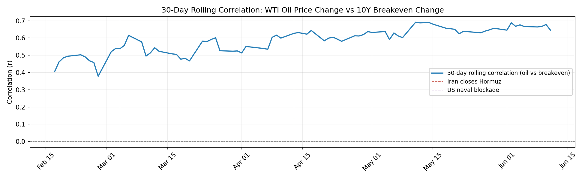
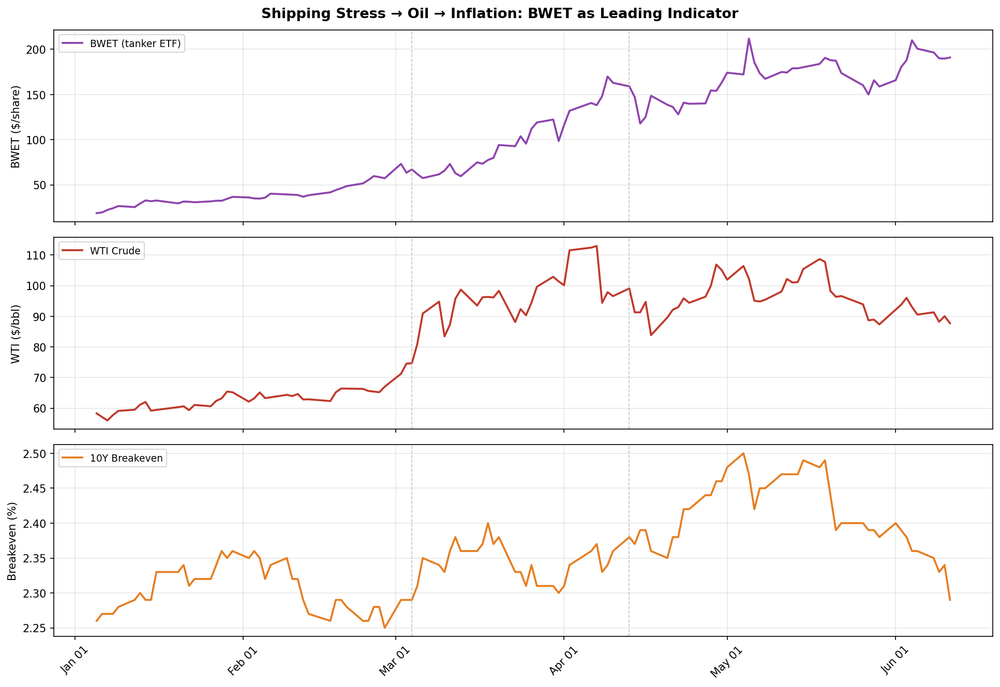
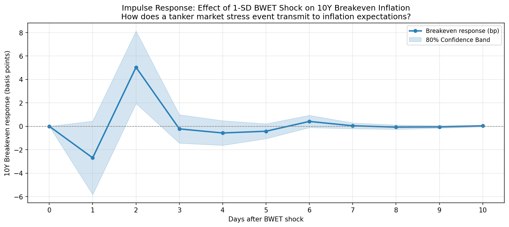

# Hormuz Risk Monitor

*A fixed income macro research tool tracking geopolitical risk transmission through oil markets to U.S. inflation expectations — with shipping stress as a leading indicator.*

---

## Motivation

As a fixed income researcher, the central question I care about is: **what drives the yield curve?**

The 2026 Strait of Hormuz crisis offered a rare natural experiment. When Iran closed the strait on March 4, 2026 — cutting off ~20% of global oil supply — it created a direct, observable shock to the oil → inflation → Fed policy transmission chain.

This project answers two questions:

> *1. Did the Hormuz blockade strengthen the pass-through from daily oil price moves to 10-year inflation expectations?*
>
> *2. Can tanker market stress predict future breakeven inflation moves — and if so, how quickly does the transmission happen?*

---

## Key Findings

**Finding 1 — The blockade strengthened oil-to-inflation pass-through by ~18%**

| Period | Oil vs. Breakeven Correlation (r) | Trading Days |
|--------|----------------------------------|--------------|
| Pre-blockade (Jan–Apr 12) | 0.525 | 68 |
| Post-blockade (Apr 13–Jun 13) | 0.622 | 43 |

The rolling correlation has since climbed to 0.65–0.70 by June 2026, suggesting the regime shift is structural, not transitory.

**Finding 2 — BWET leads 10-year breakeven by ~10 trading days**

Using BWET (Breakwave Tanker & Shipping ETF) as a tradeable proxy for Hormuz shipping stress, the lead-lag analysis shows BWET's 5-day change predicts breakeven's 5-day change most strongly at a 10-day horizon (r = 0.277, R² = 7.7%). Lags were tested from 0 to 20 days — the signal peaks at 10 and decays sharply beyond, confirming this is the true transmission window.

**Finding 3 — A BWET shock produces a statistically significant +5bp breakeven response on Day 2**

The VAR Impulse Response Function shows that a 1-standard-deviation shock to tanker market stress produces a +5bp rise in 10-year breakeven on Day 2 [80% CI: +1.95, +8.13 bp], reverting to baseline by Day 6.

*Practical implication: a rates desk monitoring BWET has approximately a 2-day window to position ahead of the breakeven move before the signal is fully priced in.*

---

## Charts


*Three-panel: WTI oil price, 10Y nominal yield vs breakeven, key crisis event timeline.*


*30-day rolling correlation between WTI daily changes and 10Y breakeven daily changes.*


*BWET (tanker ETF) vs WTI vs 10Y breakeven: three-panel time series.*


*Impulse Response Function: effect of a 1-SD BWET shock on 10Y breakeven over 10 days.*

---

## Pipeline

```bash
python main.py   # Run full pipeline (8 scripts, ~30 seconds)
```

| Script | What It Does |
|--------|-------------|
| `fetch_data.py` | Pull 10Y yields and WTI from FRED + Yahoo Finance → SQLite |
| `fetch_bdti.py` | Pull BWET tanker ETF price from Yahoo Finance → SQLite |
| `scrape.py` | Fetch Hormuz/Iran headlines from NewsAPI → SQLite |
| `analyze.py` | Static + 30-day rolling oil-breakeven correlation |
| `visualize.py` | Three-panel chart + event timeline |
| `lead_lag.py` | Lead-lag analysis: BWET vs future breakeven (lags 0–20 days) |
| `forecast.py` | VAR(2) 10-day breakeven forecast with confidence interval |
| `irf_analysis.py` | Impulse Response Function: BWET shock → breakeven response |

---

## Setup

**1. Clone the repository**
```bash
git clone https://github.com/fma8777/hormuz-risk-monitor.git
cd hormuz-risk-monitor
```

**2. Create environment**
```bash
conda create -n macro_project python=3.11
conda activate macro_project
pip install pandas yfinance fredapi requests beautifulsoup4 matplotlib python-dotenv statsmodels
```

**3. Add API keys**

Create a `.env` file in the project root.

- FRED: https://fred.stlouisfed.org/docs/api/api_key.html
- NewsAPI: https://newsapi.org/register

---

## Data Sources & Limitations

| Data | Source | Notes |
|------|--------|-------|
| 10Y nominal yield, TIPS, breakeven | FRED API | Free, 1-day lag |
| WTI crude oil futures | Yahoo Finance (`CL=F`) | Free |
| BWET tanker ETF | Yahoo Finance (`BWET`) | Proxy for BDTI; tradeable |
| News headlines | NewsAPI free tier | Recent articles only |

**On BWET as a proxy:** The Baltic Dirty Tanker Index (BDTI) is the industry standard for tanker freight rates but requires a paid institutional subscription. BWET is a publicly traded ETF tracking tanker freight futures — a tradeable proxy that is more directly actionable for a rates desk than an industry index.

**On the VAR forecast:** The point forecast is flat due to statistically insignificant coefficients — an honest result of 115 daily observations with noisy financial returns. The IRF is the more robust and informative output.
